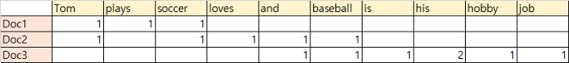
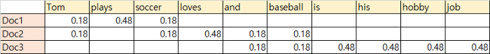

# Week2

## Word2Vec
- [참고](https://ratsgo.github.io/from%20frequency%20to%20semantics/2017/03/30/word2vec/)
- 단어를 벡터로 바꾸는 Embedding 기법
- 최초 입력으로 **one-hot-encoding**을 받음.

### Word2Vec Skip-Gram
- 중심단어로 주변단어 예측
- 

- window(한번에 학습할 단어 개수) 크기가 2인 경우
- 처음 등장하는 'The' : 앞뒤로 두 개씩 봐야 하지만 첫 단어라 뒤의 두 단어만 학습
- 'quick'과 'brown'을 따로 떼어서 각각 학습
- 모든 단어를 윈도우 크기로 슬라이딩 하며 학습하면 iteration 1회 마무리
- CBOW에 비해 Skip-gram의 성능이 좋은 이유 : 주변의 네 개 단어를 가지고 중심 단어 맞추는 것이 성능이 좋아보이겠지만 중심단어(벡터)는 단 한번의 업데이트 기회만 갖음. 
- Skip-Gram의 경우 업데이트 기회를 4번 확보 가능. 말뭉치 크기가 동일하더라도 학습량 차이가 네 배(window 크기가 2인 경우)

- Word2Vec은 중심단어와 주변 단어 벡터의 내적이 코사인 유사도가 되도록 단어 벡터를 벡터 공간에 임베딩
- [유사도](https://ratsgo.github.io/from%20frequency%20to%20semantics/2017/04/20/docsim/)

## TF-IDF
- [참고1](https://medium.com/@nsh235482/tf-idf-term-frequency-inverse-document-frequency-algorithm-55f64714880d)
- [참고2](https://nesoy.github.io/articles/2017-11/tf-idf)
### TF
- TF : **Term Frequency** - 문서에서 해당 단어가 얼마나 나타났는가
- ex) 문서에 "고양이"가 10번 나오면 TF값은 10

### IDF
- IDF : **Inverse Document Frequency**로 DF의 역수. 
- DF : 전체 문서들에서 몇 개의 문서에 해당 단어가 나타나있는지에 대한 값
- DF = 해당 단어가 나타난 문서 수 / 전체 문서수 이므로 IDF = 전체 문서 수 / 해당 단어가 나타난 문서 수
- 스케일 조정 위해 log 값 씌움. IDF = log(전체 문서 수 / 해당 단어가 나타난 문서 수)
  

### TF-IDF
- TF-IDF 는 TF와 IDF값을 곱한 값. 높을 수록 해당 문서에서 자주 등장. 다른 문서에서 등장하면 단어의 중요성이 하락
- 다른 문서에 자주 언급되지 않고 해당 문서에는 자주 언급되는 token에 대해 점수를 높게 부여

